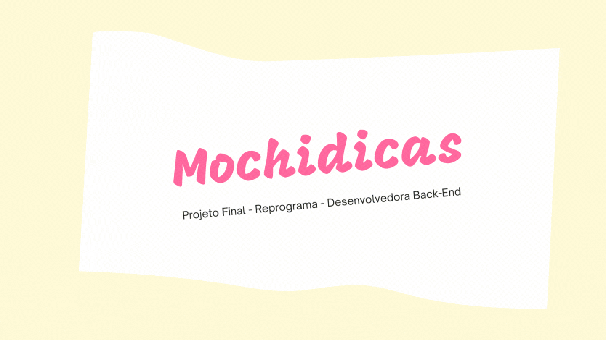

<h1 align="center">
    <br>
    <p align="center"> Mochidicas - Projeto Final {Reprograma} <p>
</h1></br>

<p align="center">

</p> <p align="center"> </p>
</h1></br>


</br>

<!--ts-->
- [ :world_map: {Mochidicas}](#-Casa-Preta-Doulas)
- [📁 Arquitetura MRC](#-Arquitetura-MRC)
- [💻 Tecnologias E Pacotes Usados](#-Tecnologias-E-Pacotes-Usados)
- [ :computer: Instalação](#-Instalação)
- [🔐 Rotas/Endpoints](#-Rotas-/-Endpoints)
- [Autora](#-Autora)


<!--te-->

</br>

## {Mochidicas}

A ideia é uma API contendo CRUD completo, banco de dados, autenticação e login, que põe em prática os conhecimentos adquiridos nas últimas 18 semanas, e que contribua para uma página de viagens, ou um blog, ou o que quer que seja que se utilize da API de forma útil. Esta API deve ser aperfeiçoada e estou aberta a sugestões, pois continuarei meu processo de estudos para melhorá-la. 
<br>

### O que será possível fazer com a API

<br>

- [x] Criar uma dica
- [x] Ler todas as dicas já cadastradas
- [x] Ler dicas especificadas por cidade
- [x] Ler dicas especificadas por estado
- [x] Ler dicas especificadas por temporada (Primavera-Verão-Outono-Inverno-Todas)
- [x] Modificar alguma dica sua
- [x] Deletar sua dica

<br>


### Arquitetura MRC
```
 📁 Mochidicas-Reprograma-ProjetoFinal
   |
   |- 📁 src
   |   |
   |   |- 📁 controllers
   |       |- 📑 dicasController.js
   |       |- 📑 perfilController.js
   |       |- 📑 usuarioController.js
   |
   |   |- 📁 database
   |       |- 📑 mongooseConect.js
   |
   |   |- 📁 models
   |       |- 📑 dicasModel.js
   |       |- 📑 perfilModel.js
   |       |- 📑 usuarioModel.js
   |
   |    |- 📁 routes
   |       |- 📑 dicasRoutes.js 
   |       |- 📑 index.js
   |       |- 📑 perfilRoutes.js   
   |       |- 📑 usuarioRotas.js
   |
   |    |- 📑 app.js
   |
   |- 📁 swagger
   |   |- 📑 swagger_output.json
   |
   |- 📑 .env
   |- 📑 .env.example
   |- 📑 .gitignore
   |- 📑 package-lock.json
   |- 📑 package.json
   |- 📑 Procfile
   |- 📑 README.md
   |- 📑 server.js
   |- 📑 swagger.js
   ```
<br>

### Tecnologias e pacotes usados
<br>

[JavaScript](https://www.javascript.com) | [Node.js](https://nodejs.org/en/) | [Git](https://git-scm.com) | [VSCode](https://code.visualstudio.com) | [Mongodb](https://www.mongodb.com) | [Heroku](https://www.heroku.com/) | [Postman](https://documenter.getpostman.com/view/16821311/UVRAHSEo)
 
 Dependências necessárisa:
- [nodemon](https://www.npmjs.com/package/nodemon)
- [bcrypt](https://www.npmjs.com/package/bcrypt)
- [cors](https://www.npmjs.com/package/cors)
- [dotenv](https://www.npmjs.com/package/dotenv)
- [express](https://www.npmjs.com/package/express)
- [jsonwebtoken](https://www.npmjs.com/package/jsonwebtoken)
- [mongoose](https://www.npmjs.com/package/mongoose)
- [swagger-autogen](https://www.npmjs.com/package/swagger-autogen)
- [swagger-ui-express](https://www.npmjs.com/package/swagger-ui-express)

<br>

### Instalação
<br>
Se você quiser ter essa APi na sua máquina, será necessário:
<br>

```bash
# Clonar o repositório
$ git clone https://github.com/Carolalves90/Projeto-Livre-FlagFeminino

# Entrar na pasta do repositório
$ cd Mochidicas-Reprograma-ProjetoFinal

# Instalar as dependências
$ npm install

# Executar o servidor
$ npm start
```
<br>

### Rotas/EndPoints:

- Usuario

| Verbo  |   EndPoint     |        Descrição da Rota                   | Status | Auth |
| ------ | -------------- | -------------------------------------------| ------ |----- |
| POST   | /usuarios/criar | Criar um novo usuário            |   201  |  ✔️  |
| GET    | /usuarios | Listar todas colaboradoras                 |   200  |  ❌  |
| POST   | /usuarios/login | Retornar um token de um usuário  |   200  |  ✔️  |
| DELETE | /usuarios/:id | Remover um usuário                |   200  |  ✔️  |

<br>

- Perfil

| Verbo  |   EndPoint      | Descrição da Rota                      | Status | Auth |
| ------ | --------------- | ---------------------------------------| ------ |----- |
| POST   | /perfil/criar | Criar um novo perfil         |   201  |  ✔️  |
| GET    | /perfis | Listar todos os perfis         |   200  |  ✔️  |
| GET    | /perfil/:id | Listar perfis por ID         |   200  |  ✔️  |
| PATCH    | /perfil/:id | Atualizar o cadastro de um perfil     |   200  |  ✔️  |
| DELETE | /perfil/:id | Remover o cadastro de um perfil       |   200  |  ✔️  |

<br>

- Dicas de viagem

| Verbo  |   EndPoint   |         Descrição da Rota               | Status | Auth |
| ------ | ------------ | ----------------------------------------| ------ |----- |
| POST   |   /dica   | Criar uma dica    |   201  |  ✔️  |
| GET    |   /listarDicas   | Retorna todas as dicas já cadastradas |   200  |  ❌  |
| GET    | /dicas/cidade | Listar dicas por cidade especificada  |   200  |  ❌  |
| GET    | /dicas/estado | Listar dicas por estado especificado  |   200  |  ❌  |
| GET    | /dicas/temporada | Listar dicas por temporada especificada  |   200  |  ❌  |
| PATCH  | /attdica/:id | Atualiza uma dica|   201  |  ✔️  |
| DELETE | /deleteDica/:id | Remover uma dica cadastrada         |   200  |  ✔️  |
<br>
Link para a documentação:

📝 [Swagger](https://mochidicas.herokuapp.com/documents/#/)

📝 [Heroku](https://mochidicas.herokuapp.com)

<br>
<br>


## Autora
</br>

<p align="center">
<a>
 
 <br/>
</a>
</p>
<p align="center"> Desenvolvido por <a href="https://www.linkedin.com/in/déborachristyna" target="_blank"></a> </p>


Há 18 semanas eu sabia zero de programação, hoje tenho aqui o resultado de um belo trabalho colaborativo de mulheres incríveis que me ajudaram a **reprogramar** parte da vida. <br> 
Obrigada a todas. <br>

<p align="center">
 <p align="center"></p>


